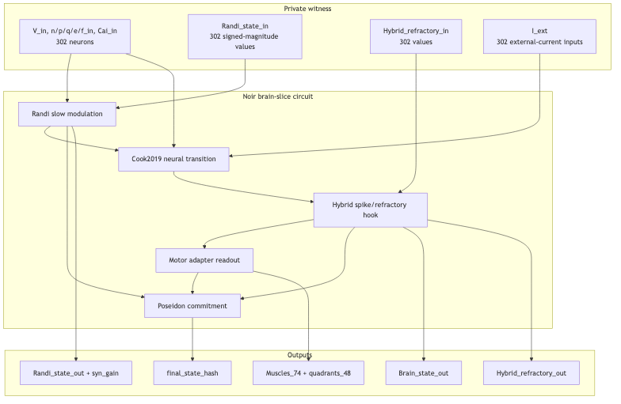

# ZKWorm-Slice



Standalone public demo slice for the ZKWorm brain circuit.

This repository contains four self-contained Noir circuits generated from the ZKWorm current-model benchmark:

- `brain_cook2019_full_hybrid_open_t1`: exposes the full public output vector for one tick.
- `brain_cook2019_full_hybrid_poseidon_t1`: exposes only the Poseidon commitment for one tick.
- `brain_cook2019_full_hybrid_open_t10`: exposes the full public output vector after ten internally continuous ticks.
- `brain_cook2019_full_hybrid_poseidon_t10`: exposes only the Poseidon commitment after ten internally continuous ticks.

All circuits prove the documented Cook 2019 brain model with dynamic Randi slow modulation, the hybrid spike/refractory hook, generated synaptic gains, and WormAtlas motor-adapter outputs.

## On-chain deployments and benchmark snapshot

Canonical rest/zero-stimulus final hash for both variants:

```text
0x1776657d57959fdcdeda347473a0bb38272678bdedd23818ab601b078ee4433f
```

### Base Sepolia deployments

| Variant | Ticks | Verifier contract | Verify tx | Public outputs | Verify gas |
| --- | ---: | --- | --- | ---: | ---: |
| Poseidon commitment | 1 | `0x4C8dDe9847DaB578175514584CFe32E5DC55Cec9` | `0x09026f39dd7027c10e62e7b420994b97a9fde66f8c8262cdfbaec14d751c9f03` | 1 field | 4,236,198 |
| Open outputs | 1 | `0x0E5e9A3FEF33a807C56F7E01f8edA205e853f394` | `0x4c724719d9ef44b0f69c6fa7db965d42f4bf55b33248c9348a9aec53c906d611` | 3143 fields | 9,218,063 |
| Poseidon commitment | 10 | `0x7a7AACF9f9D748C5C64a267338D011bB57FEA055` | `0x6c9cb32166d07f519732059464e6ea76b9854f2812332621a63579c3f1e344a1` | 1 field | 4,537,276 |
| Open outputs | 10 | `0x6c806386c6580937895aB209F0e610AED0aCc332` | `0xabc21ca8db947231a5fee3cb59f0d1f8f89b8c6c032d37caf9f10e0ddfe5ae1e` | 3143 fields | 9,525,134 |

Network details and transaction notes are in `docs/base_sepolia_verification_result.md`.

### Localhost Foundry verification

| Variant | Local verifier | Verify tx | Verify gas |
| --- | --- | --- | ---: |
| Poseidon commitment | `0xCf7Ed3AccA5a467e9e704C703E8D87F634fB0Fc9` | `0xd1cc310638b9cb1c0c5900012b2fe486d42b43e2ef6f9cb61a439857e61c0301` | 2,883,699 |
| Open outputs | `0x0165878A594ca255338adfa4d48449f69242Eb8F` | `0x62b6407b4a67f550084395182529c36887ac8836ed5ec479939955ae8c3af16b` | 7,865,564 |

Localhost was run with `anvil --code-size-limit 1000000`; details are in `docs/localhost_verification_result.md`.

### Proving artifacts and peak resource use

| Variant | Ticks | Proof size | Public-input size | nargo compile peak RAM / time | nargo execute peak RAM / time | bb write_vk peak RAM / time | bb prove peak RAM / time | bb verify peak RAM / time |
| --- | ---: | ---: | ---: | ---: | ---: | ---: | ---: | ---: |
| Poseidon commitment | 1 | 10,304 B | 32 B | 463.89 MB / 0.58 s | 482.31 MB / 1.45 s | 1022.27 MB / 2.94 s | 1231.66 MB / 8.04 s | 15.02 MB / 0.014 s |
| Open outputs | 1 | 10,304 B | 100,576 B | 433.08 MB / 0.65 s | 511.86 MB / 1.50 s | 973.58 MB / 3.21 s | 1267.81 MB / 6.54 s | 16.55 MB / 0.013 s |
| Poseidon commitment | 10 | 11,456 B | 32 B | 46,900.94 MB / 1015.83 s | 3340.82 MB / 25.19 s | 8771.15 MB / 28.47 s | 10,457.50 MB / 43.02 s | 9.27 MB / 0.018 s |
| Open outputs | 10 | 11,456 B | 100,576 B | 49,973.37 MB / 1023.44 s | 3344.19 MB / 25.43 s | 8857.45 MB / 37.26 s | 10,489.85 MB / 42.81 s | 10.02 MB / 0.020 s |

The 10-tick rows were built on a Vast x86_64 Ubuntu builder with about 251 GiB RAM because local macOS Nargo compilation OOMed. Logs are under `runs/cook2019_full_hybrid_*_t10/vast_t10_20260619_b/`.


## Toolchain

These versions are intentionally specific. Other Nargo/BB versions can fail to compile/prove the generated circuits or produce incompatible artifacts.

```text
nargo 1.0.0-beta.19
bb 5.0.0-nightly.20260419
```

Reference binary hashes from the originating benchmark machine:

```text
nargo sha256: 3d01d542e86ef05cf28c3b7862f2941192c695b5067cc5caaf40e4f080eb0f4e
bb sha256:    d11fb1cba3928155c4c060c7723d06aeaece12196d127b21ad6b4a69d61e1569
```

The demo runner defaults to:

```text
~/.nargo/bin/nargo
~/.bb/bb
```

Override paths if needed:

```sh
NARGO_PATH=/path/to/nargo BB_PATH=/path/to/bb python3 scripts/run_demo.py --variant both --prove
```

## Quick start

Compile and execute both variants without proving:

```sh
python3 scripts/run_demo.py --variant both
```

Compile, execute, prove, and verify both variants:

```sh
python3 scripts/run_demo.py --variant both --prove
```

Run only one one-tick mode, or run the 10-tick batch:

```sh
python3 scripts/run_demo.py --variant open --prove
python3 scripts/run_demo.py --variant poseidon --prove
python3 scripts/run_demo.py --variant both_t10 --prove
```
Artifacts and logs are written under `runs/`.

## Foundry verifier demo

Generate a Solidity verifier, deploy it, and execute proof-verification transactions with Foundry:

```sh
# Terminal 1
anvil --code-size-limit 1000000

# Terminal 2
export PRIVATE_KEY=0xac0974bec39a17e36ba4a6b4d238ff944bacb478cbed5efcae784d7bf4f2ff80
python3 scripts/deploy_and_verify.py --variant poseidon --rpc-url http://127.0.0.1:8545
python3 scripts/deploy_and_verify.py --variant open --rpc-url http://127.0.0.1:8545
```

Base Sepolia usage is documented in `docs/foundry_deployment.md`.

## Expected canonical outputs

Canonical rest/zero-stimulus witness final hash for both modes:

```text
0x1776657d57959fdcdeda347473a0bb38272678bdedd23818ab601b078ee4433f
```

Expected public-output counts:

```text
open:     3143 fields
poseidon: 1 field
```

Reference proof/public-input binaries and manifests from the originating full repository are in `docs/`.

## Multi-tick continuity proof

The `*_t10` circuits unroll ten internal ticks. Each tick consumes the exact state variables produced by the previous tick (`v`, `n`, `p`, `q`, `e`, `f`, `cai`, Randi state, and hybrid refractory state), so continuity is proven inside a single proof rather than trusted from an external trace. The private input `i_ext` is a ten-row external-current schedule; the canonical benchmark uses all-zero current for all ten ticks.

This is not the full 60-second activity-trace diagnostic from the source repository. That diagnostic is 12,000 main timesteps per sensory probe, with 60,000 neural substeps, and is not currently practical as one unrolled Noir circuit. See `docs/multi_tick_circuit_plan.md`.

## Open-output public layout

```text
pub [Field; 3143]
[0]          final_state_hash
[1..302]     v[0..301]
[303..604]   n[0..301]
[605..906]   p[0..301]
[907..1208]  q[0..301]
[1209..1510] e[0..301]
[1511..1812] f[0..301]
[1813..2114] cai[0..301]
[2115..2416] randi_state signed-magnitude[0..301]
[2417..2718] syn_gain[0..301] scale=1000
[2719..3020] hybrid_refractory_out[0..301] ms*1000
[3021..3094] muscle[0..73] scale=1000
[3095..3142] quadrants[12][4] flattened segment-major, scale=1000
```

The Poseidon variant returns only `final_state_hash`.

## Model boundary

The circuits are generated artifacts, so this slice does not require the full Python model or the original connectome spreadsheets at runtime. The circuits encode the generated current-model constants directly.

Included model components:

- 302-neuron Cook 2019 connectome transition.
- 3,709 chemical edges and 2,199 directed gap-junction entries.
- Randi slow modulation with 796 source edges, 160 matched neurons, and signed-magnitude state encoding.
- Hybrid spike/refractory hook for `AVL`, `AWAL`, `AWAR`, `DVB` after neural state update and before motor output.
- WormAtlas motor adapter with 74 muscle landmarks, 357 motor targets, and 12x4 quadrant aggregation.

Known boundary: sigmoid/exponential dynamics are deterministic fixed-point approximations of the source Python floating-point model, not bit-for-bit Python-float emulation.

## Reference provenance

Originating repository commit for the generated circuit metadata:

```text
d8454642be654ea3d6a2e8e18e4c788f4d86185f
```

The standalone slice was extracted from `LPSCRYPT/zkworm-working` after the canonical slice artifacts were committed there.
