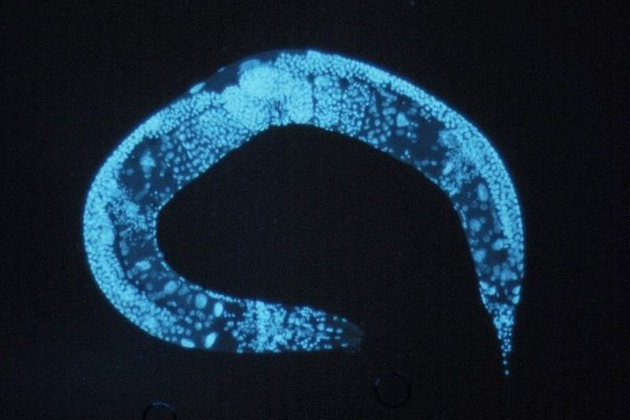
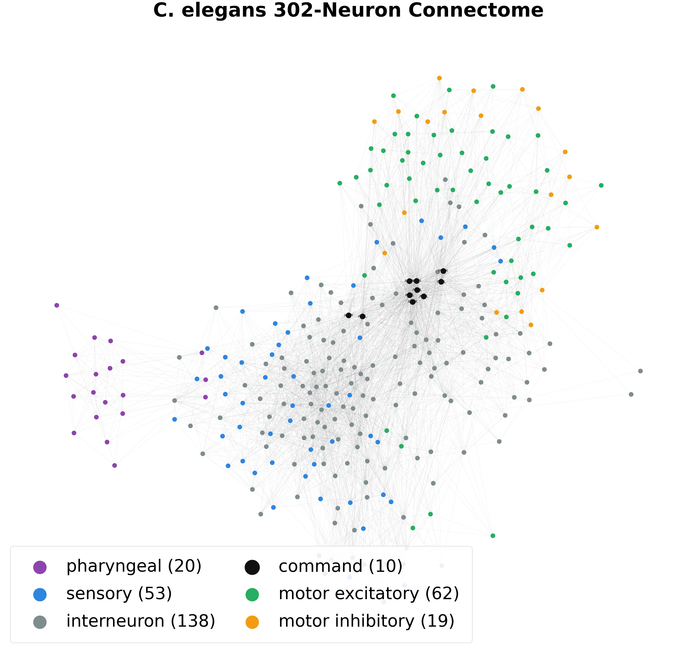
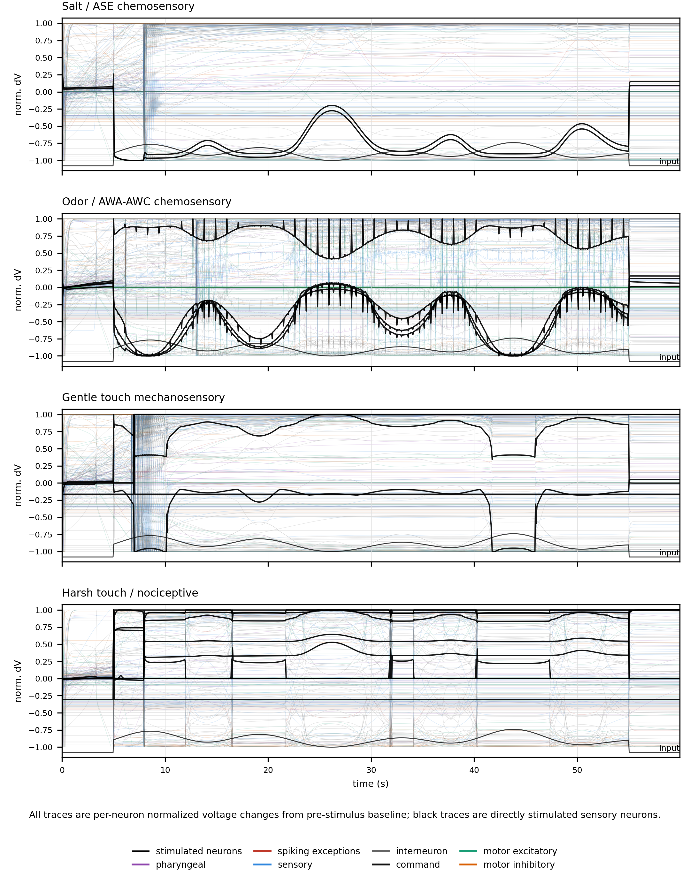
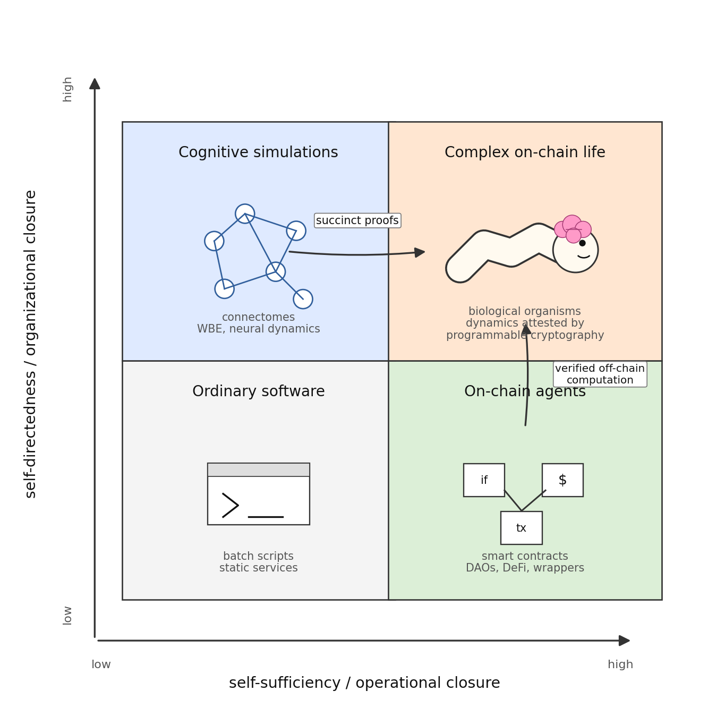

# Supplementary Materials

This document converts the appendix from `LPSCRYPT/zkworm-working/paper/paper.tex` into standalone Markdown supplementary material for the ZKWorm paper. Figure and table titles are numbered here as supplementary items so the paper can reference them unambiguously.

## Supplementary Methods: Circuit Transition Boundary

The formal boundary is the brain-state transition implemented by the circuit. Let `M_t = (V_t, n_t, p_t, q_t, e_t, f_t, Ca_t, R_t, H_t)` denote the private recurrent state, including voltage, gates, calcium, slow modulation, and hybrid refractory state. Let `I_t` denote the external-current vector. With fixed neural parameters and fixed Cook 2019 connectome constants, one circuit tick constrains:

$$
M_{t+1}=F_\theta(M_t,I_t;W_\mathrm{chem},W_\mathrm{gap}).
$$

The implementation is not a symbolic proof of the continuous biological equations. It is a deterministic fixed-point approximation of the model used in the repository: graded chemical synapses, ohmic gap junctions, bounded Randi-style postsynaptic gain, the hybrid calcium-spike/refractory hook, and the WormAtlas motor-output map are compiled into arithmetic constraints with explicit clipping.

The ten-tick circuit composes the same relation internally:

$$
M_{t+k+1}=F_\theta(M_{t+k},I_{t+k};W_\mathrm{chem},W_\mathrm{gap}),\quad k=0,\ldots,9.
$$

Because `M_{t+k+1}` is a circuit variable passed directly to the next iteration, continuity across those ten ticks is constrained inside the proof. This is different from submitting ten independent one-tick proofs, where a verifier contract must enforce continuity by checking that each public input commitment equals the previous output commitment.

The public output is organized as either an open vector or a compact commitment. Let `O_{t+1}` collect the next neural state, generated synaptic gains, hybrid refractory state, 74 muscle activations, and 48 quadrant aggregates. In the ten-tick circuit, `O_{t+10}` is the final output after the internal rollout. The Poseidon2 commitment is:

$$
h_{t+1}=H_\mathrm{P2}(O_{t+1}),
$$

or `h_{t+10}=H_P2(O_{t+10})` for the ten-tick variant, where `H_P2` denotes the fixed absorption schedule used by the implementation. The open-output verifier exposes `O` together with `h`; the compact verifier exposes only `h`.

The deployed single-tick proof establishes that some private prior state `M_t` satisfies the fixed transition relation and produces the published output or commitment. It does not, by itself, prove continuity from a previously accepted tick. A chained deployment would add a public input commitment `h_t` and require it to match the prior accepted output commitment. The ten-tick proof establishes this continuity internally only for the ten unrolled ticks.

## Table S1. Brain Circuit Benchmarks

Both one-tick and ten-tick rows report deployed Base Sepolia proof variants. Build-time and proof-time resource measurements are separated because circuit compilation and proof generation have different memory profiles.

| Mode | Ticks | Full output | Poseidon2 |
| --- | ---: | ---: | ---: |
| Prove time | 1 | 6.54 s | 8.04 s |
| Peak RAM | 1 | 1,267.81 MB | 1,231.66 MB |
| Proof size | 1 | 10.3 KB | 10.3 KB |
| Public outputs | 1 | 3,143 fields | 1 field |
| Public input bytes | 1 | 100,576 | 32 |
| Base Sepolia gas | 1 | 9,218,063 | 4,236,198 |
| Circuit build time | 10 | 1023.44 s | 1015.83 s |
| Circuit build peak RAM | 10 | 49,973.37 MB | 46,900.94 MB |
| Prove time | 10 | 42.81 s | 43.02 s |
| Prove peak RAM | 10 | 10,489.85 MB | 10,457.50 MB |
| Proof size | 10 | 11.5 KB | 11.5 KB |
| Public input bytes | 10 | 100,576 | 32 |
| Base Sepolia gas | 10 | 9,525,710 | 4,537,264 |

## Figures

The organism image and annotated Cook 2019 graph are shown here rather than in the main text to keep the central exposition focused on the proof boundary and results.

### Figure S1. *Caenorhabditis elegans* Reference Organism

*Caenorhabditis elegans*, the 1 mm nematode whose 302-neuron nervous system is the only connectome fully mapped at synaptic resolution. Image: Broad Institute.

### Figure S2. Annotated Cook 2019 Connectome Graph

Connectome graph with the ZKWorm annotation layer used for model inspection. Purple nodes are pharyngeal neurons, blue nodes are sensory neurons, gray nodes are interneurons, black nodes are command interneurons, green nodes are excitatory locomotor motor neurons, and orange nodes are inhibitory locomotor motor neurons.

The sensory trace diagnostic underlying the model-validity discussion is included here because it supports the limitation analysis more than the central circuit result.

### Figure S3. All-Neuron Sensory Trace Diagnostic

All-neuron voltage traces for four sensory probes. Each stacked panel shows all 302 neurons over 60 s as per-neuron normalized voltage change from the pre-stimulus baseline. Trace colors indicate neuron classes, black traces mark the directly stimulated sensory neurons, and the small input line shows the stimulus timing. These are substrate-response diagnostics, not locomotion-success claims.

The autonomy quadrant diagram summarizes the substrate argument that motivates ZKWorm: biological organisms combine self-sufficiency and self-directedness, while ordinary blockchain agents and off-chain biophysical simulations each occupy only one side of that split.

### Figure S4. Four-Quadrant Model of Complex On-Chain Life

Four-quadrant model of complex on-chain life. The horizontal axis combines the AI-autonomy concept of self-sufficiency with the autopoietic concept of operational closure; the vertical axis combines self-directedness with organizational closure. Programmable cryptography moves biophysical simulations toward the high/high quadrant by making off-chain cognitive dynamics verifiable on a self-sustaining blockchain substrate.

## Table S2. Base Sepolia Deployment Records

The proof system was deployed and exercised on Base Sepolia in separate one-tick and ten-tick verifier variants. Each deployment used a separately generated Solidity verifier because each tick count and disclosure mode has a distinct circuit relation and verification key. The ten-tick rows use the sinusoidal AWAL/AWAR witness described in the paper; the one-tick rows use the rest/zero-stimulus witness.

| Variant | Ticks | Record | Address or hash | Gas used |
| --- | ---: | --- | --- | ---: |
| Full output | 1 | Verifier | `0x0E5e9A3FEF33a807C56F7E01f8edA205e853f394` | -- |
| Full output | 1 | Verify tx | `0x4c724719d9ef44b0f69c6fa7db965d42f4bf55b33248c9348a9aec53c906d611` | 9,218,063 |
| Poseidon2 | 1 | Verifier | `0x4C8dDe9847DaB578175514584CFe32E5DC55Cec9` | -- |
| Poseidon2 | 1 | Verify tx | `0x09026f39dd7027c10e62e7b420994b97a9fde66f8c8262cdfbaec14d751c9f03` | 4,236,198 |
| Full output | 10 | Verifier | `0x6c806386c6580937895aB209F0e610AED0aCc332` | -- |
| Full output | 10 | Verify tx | `0xa490a38e44ac7253adcca83689c688d7cad9c11cdef7f447fc8b29f1f995c790` | 9,525,710 |
| Poseidon2 | 10 | Verifier | `0x7a7AACF9f9D748C5C64a267338D011bB57FEA055` | -- |
| Poseidon2 | 10 | Verify tx | `0xceb984595ef19ba647608fe85ab2d1ff7a707ded54eceab0ae55026b1094c51c` | 4,537,264 |
